<div align="center">

# 👋 Hi, I'm SS07158


**I build practical AI-powered applications, data tools, and automation projects.**

Currently focused on **Artificial Intelligence, Machine Learning, NLP, and building useful software.**

<br>

[](https://github.com/SS07158)

[](https://www.linkedin.com/in/saad-shaikh-1b9265259/)

</div>

---

## 🧠 About Me

I'm a developer interested in building **intelligent software and practical AI-powered applications**.

I learn primarily by **building projects, experimenting with new technologies, and solving real-world problems**.

### Areas I'm interested in

* 🤖 Artificial Intelligence & Machine Learning
* 🧠 Natural Language Processing
* 📊 Data Science & Exploratory Data Analysis
* 🔗 LLM-powered applications
* ⚙️ Automation
* 🚀 ML deployment & MLOps

---

## 🔭 What I'm Doing Now

* 🤖 Strengthening my **Machine Learning** fundamentals
* 🧠 Exploring **NLP, LLMs and AI applications**
* 📊 Improving my **Data Science** skills
* ⚙️ Learning how to take ML projects toward **production**
* 🚀 Building projects that combine **AI + real-world workflows**

---

## 🛠️ Tech Stack

### Languages


### AI / ML & Data


### Development & Tools


### AI & Automation


---

## 🚀 Featured Projects

<div align="center">

### 🤖 ResumeIQ

**AI-powered Resume Analysis & Career Assistant**

An AI-powered application that analyzes resumes against job descriptions and provides actionable insights for improving ATS compatibility, identifying skill gaps, generating cover letters, preparing interview questions, and creating career roadmaps.

**`Python` `FastAPI` `Streamlit` `NLP` `Sentence Transformers` `Scikit-learn` `Groq`**

[](https://github.com/SS07158/ResumeIQ)

</div>

---

<div align="center">

### 📊 EDA Buddy

**Interactive Exploratory Data Analysis Platform**

A data exploration platform designed to make EDA easier by helping users understand datasets, visualize patterns, detect outliers, perform preprocessing, and generate reusable Python code.

**`Python` `Pandas` `NumPy` `Scikit-learn` `Plotly` `SciPy` `Streamlit`**

[](https://github.com/SS07158/EDA-Buddy)

</div>

---

<div align="center">

### 🛒 Hot Wheels Tracker

**Product Availability Monitoring & Automation**

A Python automation project that monitors product availability and sends Telegram notifications when tracked products become available.

**`Python` `Playwright` `Telegram Bot API`**

[](https://github.com/SS07158/hotwheels-tracker)

</div>

---

<div align="center">

### 🔎 More Projects

I have more experiments, tools, and projects in my repositories.

[](https://github.com/SS07158?tab=repositories)

</div>


## 📚 Currently Learning

```text
Machine Learning       ████████████████░░░░
NLP / LLMs             ███████████████░░░░░
Data Science           ███████████████░░░░░
AI Applications        █████████████████░░░
MLOps                  ████████░░░░░░░░░░░░
```

> Building my skills one project at a time. 🚀

---

## 📈 GitHub Stats

<div align="center">




</div>

---

## 🎯 My Goal

> **Build AI systems that are not only interesting, but actually useful.**

I'm working toward becoming a strong **AI/ML developer** by combining solid fundamentals, hands-on projects, and real-world problem solving.

---

## 🤝 Let's Connect

I'm always interested in connecting with people passionate about:

**AI • Machine Learning • Data Science • Software Development • Building Useful Things**

<div align="center">

### Thanks for visiting! 🚀

⭐ Feel free to explore my repositories and projects.

</div>
