  

  <b>Building intelligent systems with Machine Learning, Deep Learning, NLP & LLMs.</b>

  <a href="https://github.com/SS07158">GitHub</a> •
  <a href="https://www.linkedin.com/in/saad-shaikh-1b9265259/">LinkedIn</a>

  🤖 Artificial Intelligence &nbsp;•&nbsp;
  🧠 Machine Learning &nbsp;•&nbsp;
  💬 NLP & LLMs

---

---

## 🧠 About Me

I'm an **AI/ML Engineer focused on building practical intelligent systems** that turn ideas and real-world problems into useful software.

My current focus is on:

- 🧠 **Machine Learning & Deep Learning** — building strong fundamentals and applying them to real projects
- 🔤 **NLP & LLMs** — exploring Transformers, LLM-powered applications, and modern AI workflows
- ⚙️ **AI Engineering** — building APIs and applications with technologies like PyTorch, FastAPI, Docker, and AWS
- 🚀 **Learning by building** — experimenting with new technologies and turning what I learn into working projects

> **I believe the best way to learn AI is to build with it.**

---

## 🔭 What I'm Doing Now

* 🤖 Strengthening my **Machine Learning** fundamentals
* 🧠 Exploring **NLP, LLMs and AI applications**
* 📊 Improving my **Data Science** skills
* ⚙️ Learning how to take ML projects toward **production**
* 🚀 Building projects that combine **AI + real-world workflows**

---

## 🛠️ Tech Stack

### 💻 Languages

  
  
  

### 🤖 Machine Learning & Deep Learning

  
  
  
  

  
  
  
  
  

### 📊 Data Science

  
  

  
  
  
  
  
  

### 📈 Data Visualization & Apps

  
  
  
  

### ⚙️ Backend, Cloud & Deployment

  
  
  

### 🔧 Tools & Databases

  
  
  

---

## 🚀 Featured Projects

### 🤖 ResumeIQ
**AI-Powered Resume Analysis & Career Assistant**

> An end-to-end AI application that analyzes resumes against job descriptions and provides personalized career insights. ResumeIQ combines NLP, semantic similarity, ATS scoring, and LLM-powered generation to help users improve their resumes and prepare for interviews.

**✨ What it does**

- 📄 Analyzes resumes against job descriptions
- 🎯 Calculates ATS, semantic, and skill-match scores
- 📝 Generates personalized resume improvement suggestions
- ✉️ Creates customized cover letters
- 🎤 Generates technical, behavioral, and project-based interview questions
- 🚀 Builds personalized career roadmaps

**🛠️ Built With**

`Python` `FastAPI` `Streamlit` `NLP` `Sentence Transformers` `Scikit-learn` `Groq` `LLMs`

  
  

---

### 📊 EDA Buddy
**Interactive Exploratory Data Analysis Platform**

> A beginner-friendly platform designed to make Exploratory Data Analysis more interactive and understandable. EDA Buddy helps users explore datasets, identify patterns, detect outliers, perform preprocessing, and generate reusable Python code.

**✨ What it does**

- 📂 Upload and explore datasets interactively
- 🔍 Perform automated exploratory data analysis
- 📈 Generate interactive visualizations
- 🚨 Detect outliers and missing values
- 🧹 Perform common preprocessing operations
- 🧪 Apply basic feature engineering techniques
- 💻 Generate reusable Python code

**🛠️ Built With**

`Python` `Pandas` `NumPy` `Scikit-learn` `SciPy` `Plotly` `Streamlit`

  
  

---

### 🛒 Hot Wheels Tracker
**Automated Product Availability Monitoring**

> A Python automation tool that monitors product availability and sends real-time Telegram notifications when tracked products become available.

**✨ What it does**

- 🔎 Monitors selected product pages
- ⚡ Detects product availability automatically
- 📱 Sends Telegram notifications
- 🔄 Automates repetitive availability checking
- 🌐 Uses browser automation for dynamic websites

**🛠️ Built With**

`Python` `Playwright` `Telegram Bot API`

  

---

### 🔎 More Projects

I experiment with different AI/ML ideas, data applications, and software projects.

  

## 📚 Currently Learning

  

  <i>Building → Experimenting → Improving</i>

### 🧠 Deep Learning & NLP

- 🔥 Deep Learning architectures and neural networks
- 🧠 Transformers and modern NLP techniques
- 🤗 Exploring transformer-based models and LLM applications
- ⚡ PyTorch for building and experimenting with deep learning models

### 🔗 LLM Application Development

- 🦜 LangChain — currently learning and experimenting with LLM application workflows
- 🔍 Retrieval-Augmented Generation (RAG)
- 🧩 Building practical LLM-powered applications

### 🚀 Moving Toward Production

- 🐳 Docker & containerized ML applications
- ☁️ AWS deployment
- ⚙️ FastAPI-based ML services
- 📦 Exploring practical MLOps workflows

> **Learning by building, experimenting, and turning ideas into useful AI applications.** 🚀

---

## 📈 GitHub Stats

---
## 🐍 Contribution Activity

---
## 🎯 What I'm Building Toward

> **Build AI systems that are not only interesting, but actually useful.**

I'm focused on becoming a strong **AI/ML Engineer** by combining solid fundamentals, hands-on experimentation, and real-world problem solving.

My goal is to build systems that move beyond demos — **reliable, useful, and capable of solving real problems.**

---

## 🤝 Let's Connect

  Interested in <b>AI, Machine Learning, Deep Learning, NLP, LLMs</b>, and building useful software?

  
  

  <i>Thanks for stopping by. Feel free to explore my projects and repositories. 🚀</i>

